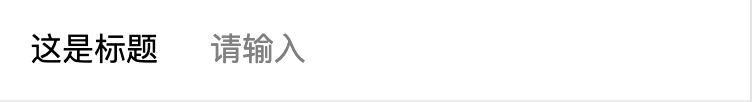

# 一. input输入框
### 使用指南
在app.json或相应的index.json中引入组件
```
  "usingComponents": {
    "demo-input": "path/components/input/input
  }
```
### 代码演示
```
  <demo-input bindchange="onChange"/> 
```
```
  Page({
    data: {
      value:''
    },

    onChange(event) {   
      this.setData({
        value: event.detail
      });
    }
  });
```
### input API
|参数|说明|类型|默认值|
|--|--|---|---|
|placeholder|提示语|string|请输入|
|title|标题|string|这是标题|
|height|input高度|number|108|
|width|标题的宽度|number|210|
|textIndex|标题首行缩进|number|30|
|font|字体大小|number|32|
### 样式


# 二. 自适应的 input输入框
### 使用指南
在app.json或相应的index.json中引入组件
```
  "usingComponents": {
    "demo-auto-input": "path/components/autoInput/autoInput"
  }
```
### 代码演示
```
  <demo-auto-input bindchange="onChange"/> 
```
```
  Page({
    data: {
      value:''
    },

    onChange(event) {   
      this.setData({
        value: event.detail
      });
    }
  });
```

# 三. select 选择器
### 使用指南
在app.json或相应的index.json中引入组件
```
  "usingComponents": {
    "demo-select": "path/components/select/select
  }
```
# 四. tab 切换
### 使用指南
在app.json或相应的index.json中引入组件
```
  "usingComponents": {
    "demo-tab": "path/to/vant-weapp/dist/checkbox/index"
  }
```
# 五. cardUpper 底部弹出
### 使用指南
在app.json或相应的index.json中引入组件
```
  "usingComponents": {
    "demo-card-upper":"path/components/cardUpper/cardUpper"
  }
```
# 六. addPic 添加图片
### 使用指南
在app.json或相应的index.json中引入组件
```
  "usingComponents": {
    "demo-add-pic": "path/components/addPic/addPic"
  }
```


